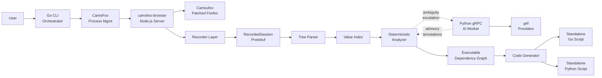
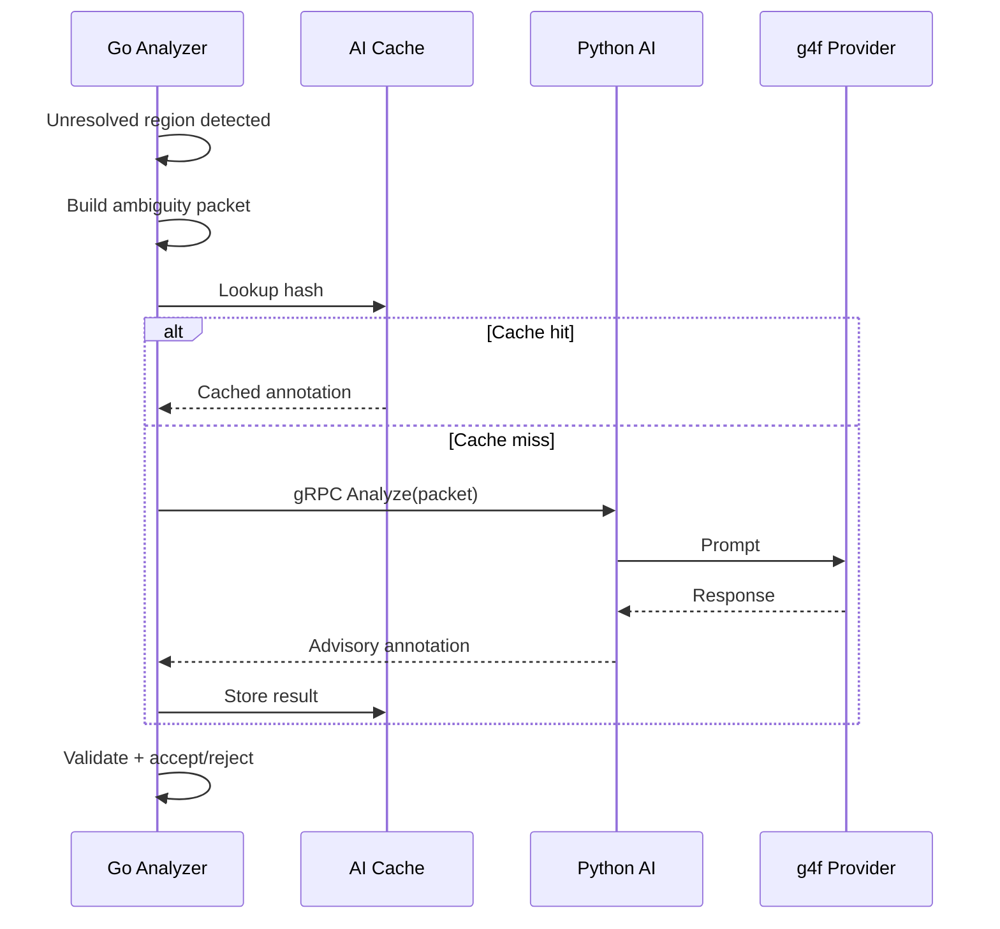
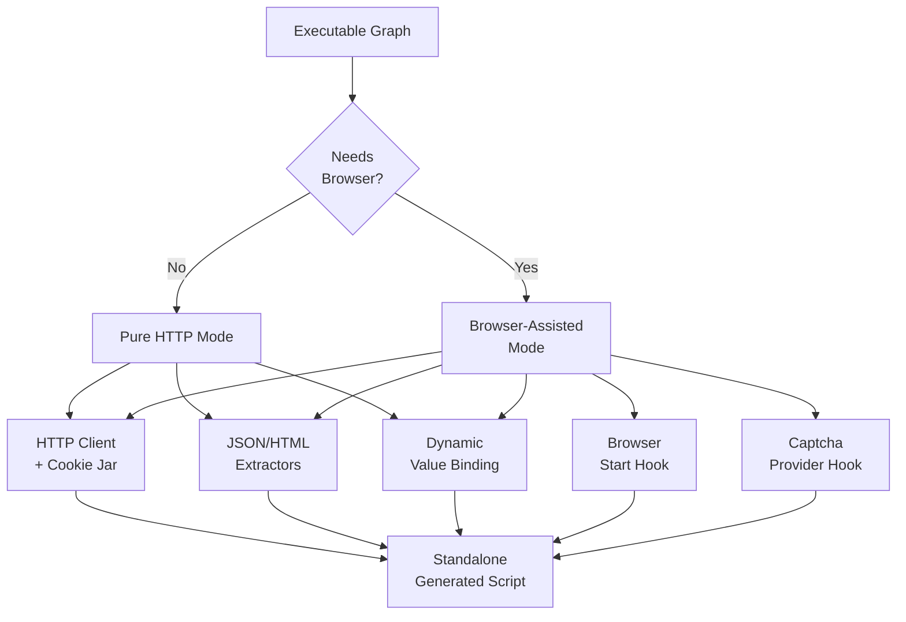

# autohttp — Component Architecture & Layout

Date: 2026-06-21

## Component Architecture

### Go CLI / Orchestrator

`cmd/autohttp` is the main user entrypoint and owns the full pipeline.

Commands:

- `autohttp record <url>` starts CamoFox and begins capture.
- `autohttp stop` finalizes the recording and writes artifacts.
- `autohttp analyze` builds the deterministic dependency graph.
- `autohttp generate` emits a standalone Go or Python script.
- `autohttp inspect` lets users review requests, fields, dependencies, confidence scores, and AI escalation points.

Go owns orchestration because this project is fundamentally a high-performance HTTP/session compiler, not an AI application.

### CamoFox Process Manager

`internal/camofox` manages `@askjo/camofox-browser` as an external Node process.

Responsibilities:

- Start and stop CamoFox via `npx`, a local Node install, Docker, or a source checkout.
- Configure CamoFox environment: port, access key, profile directory, trace directory, proxy settings, and VNC.
- Call CamoFox REST endpoints directly.
- Create tabs with `trace: true`.
- Fetch storage state, snapshots, JavaScript evaluation results, screenshots, and traces.
- Keep CamoFox replaceable as a browser backend.

The actual runtime architecture is Go core, Node/CamoFox recorder, and optional Python AI worker.

### Recorder Layer

`internal/record` is the abstraction for capture backends.

Initial backends:

- CamoFox trace recorder: uses Playwright trace output from CamoFox. Useful for v0, but should not be the only long-term source of truth.
- CamoFox network-event recorder: preferred long-term backend. A small MIT-compatible extension or patch exposing structured request and response events directly.
- Optional proxy recorder later: useful for raw HTTP visibility, but not default because MITM interception can alter browser and TLS behavior.

The recorder outputs a canonical `RecordedSession`.

### Canonical Session Model

`pkg/session` defines the shared data model through Protocol Buffers.

Core entities:

- `RecordedSession`
- `HttpExchange`
- `Request`
- `Response`
- `Header`
- `CookieMutation`
- `StorageMutation`
- `JsEvaluation`
- `UserAction`
- `ParsedTree`
- `DynamicCandidate`
- `DependencyEdge`
- `LogicalOperation`

This is the source of truth between Go and Python. Go and Python must not define duplicated hand-written contracts.

### Deterministic Tree Parser

`internal/tree` parses every captured artifact into typed trees.

Tree types:

- URL path and query tree
- Header tree
- Cookie tree
- JSON request and response tree
- Form body tree
- Multipart body tree
- HTML tree, especially hidden inputs, meta tags, and scripts
- Text response token tree
- LocalStorage and sessionStorage tree

Most inference should be tree comparison, not LLM prompting.

### Value Index And Normalization Engine

`internal/index` builds an inverted index of every scalar value and normalized variant.

It tracks:

- Exact values
- URL-decoded values
- HTML-decoded values
- Base64-decoded values
- JWT header, payload, and signature parts
- JSON-stringified variants
- Timestamps
- UUIDs
- Hash-shaped values
- High-entropy tokens
- CSRF, nonce, session, and fingerprint-looking names

This is the main engine for discovering dependencies cheaply.

### Deterministic Analyzer

`internal/analyze` is the primary intelligence layer.

Responsibilities:

- Classify static vs dynamic fields.
- Infer request-response dependencies.
- Track cookie propagation.
- Track localStorage and sessionStorage propagation.
- Detect hidden input to form submission flows.
- Detect redirect parameter propagation.
- Filter noise requests.
- Group requests into likely logical operations.
- Assign confidence scores to every decision.

AI is not part of the normal path. The analyzer should produce a useful graph with `--no-ai`.

### AI Escalation Worker

`python/autohttp_ai` is an optional Python gRPC worker using `g4f` by default.

It is called only when deterministic confidence is below a configured threshold. It receives small ambiguity packets, not the full session by default.

Example tasks:

- Choose between several plausible upstream sources for one downstream token.
- Decide whether a low-confidence request is functional or analytics noise.
- Identify likely anti-bot or challenge system from a small page/context excerpt.
- Suggest a human-friendly logical operation name.

The worker returns advisory annotations with confidence. Go validates them before use.

Because `g4f` is GPLv3 and provider reliability varies, the interface must remain provider-neutral. `g4f` is the default open-source provider, not the architectural dependency.

### Dependency Graph Engine

`internal/graph` converts deterministic analysis plus validated AI hints into an executable graph.

Node types:

- HTTP request node
- Response extraction node
- Cookie/storage update node
- JavaScript evaluation node
- Captcha challenge node
- Browser-assisted fallback node
- Logical operation node

Edges represent data flow. This graph is the intermediate representation used by code generation.

### Challenge And Anti-Bot Adapter Layer

`internal/challenge` handles captcha and anti-bot events.

Responsibilities:

- Detect challenge and captcha pages.
- Expose provider hooks for captcha solvers.
- Bind returned captcha tokens into downstream requests.
- Mark graph regions requiring browser-assisted runtime.
- Keep provider-specific integrations outside the core analyzer.

### Code Generator

`internal/generate` emits standalone Go or Python scripts from the graph.

Rules:

- Generation is deterministic and template-based.
- AI does not write final executable code.
- Generated scripts do not depend on `autohttp`, `g4f`, or gRPC workers.
- Output supports pure HTTP mode first, with browser-assisted fallback only when required.

### Standalone Runtime

`runtime/go` and `runtime/python` are tiny generated or vendored runtime pieces included with output scripts as needed.

Capabilities:

- HTTP client
- Cookie jar
- Header/body templating
- Extractors for JSON, HTML, regex, cookies, and storage-like values
- Optional TLS/client fingerprinting support
- Optional JavaScript evaluation support
- Optional captcha-provider hook

The runtime must stay small. If a generated script only needs HTTP and JSON extraction, it should not include browser or AI code.

## Visual Architecture

### System Overview



### AI Escalation Sequence



### Generated Runtime Fork



## Project Layout

```text
autohttp/
  cmd/
    autohttp/
      main.go

  internal/
    camofox/
    record/
    normalize/
    tree/
    index/
    analyze/
    graph/
    challenge/
    generate/
    verify/

  pkg/
    session/
    runtime/
    gen/

  proto/
    autohttp/
      v1/
        session.proto
        tree.proto
        analysis.proto
        graph.proto
        ai.proto

  python/
    autohttp_ai/
      server.py
      providers/
      prompts/
      gen/

  runtime/
    go/
    python/

  testdata/
    fixtures/
    targets/

  .autohttp/
    sessions/

  .agents/
    specs/
    links/
```

### Layout Principles

- `internal/` holds Go implementation not meant as public API.
- `pkg/session` holds stable public session/graph types for library consumers.
- `proto/` is the source of truth for Go/Python contracts.
- `python/autohttp_ai` is optional and isolated.
- `runtime/` contains minimal code copied or embedded into generated scripts.
- `.agents/specs/` holds design and planning docs.

### Dependency Principles

- Go core should not import Python or Node packages directly.
- CamoFox is an external process behind REST.
- Python AI is an external process behind gRPC.
- Generated scripts should not import from `autohttp`.
- `g4f` must stay isolated behind the provider interface.