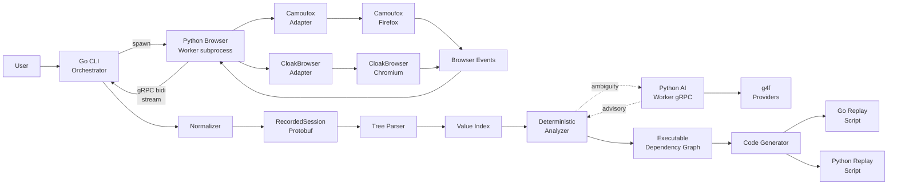
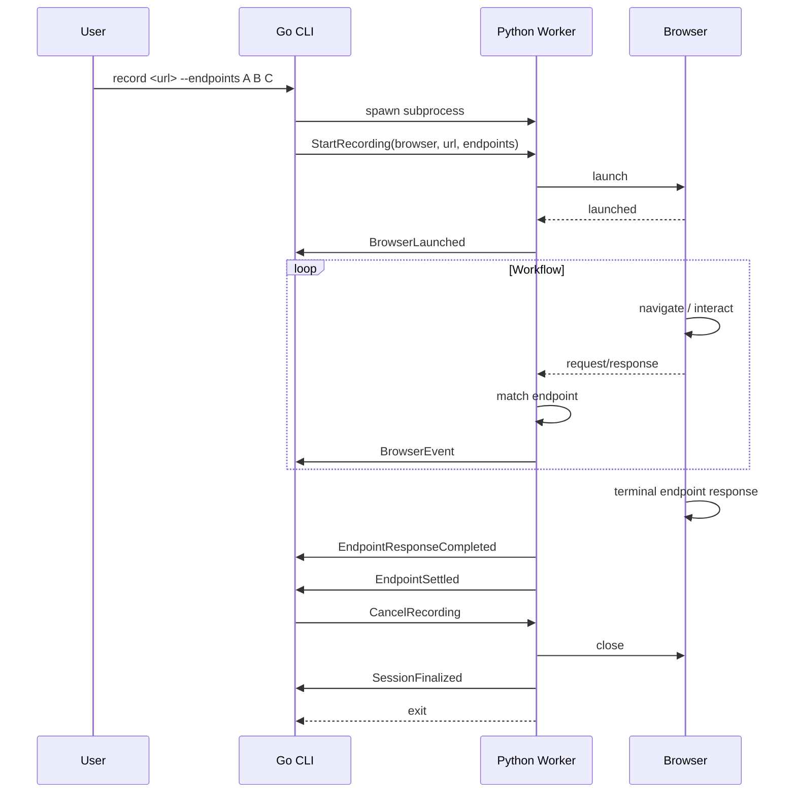
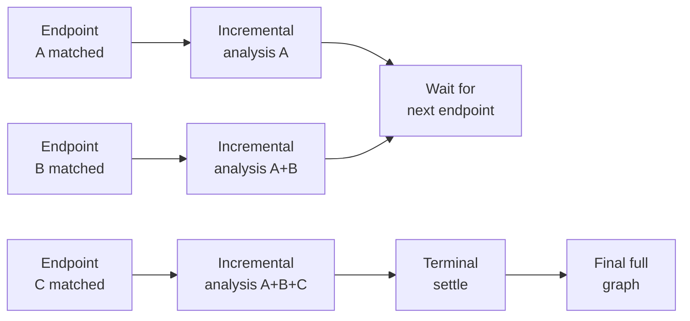

# autohttp Component Architecture

Date: 2026-06-23

## Component Architecture

### Go CLI / Orchestrator

`cmd/autohttp` is the main user entrypoint and owns the full pipeline.

Commands:

- `autohttp record <url>` starts the Python browser worker and begins capture.
- `autohttp analyze` runs deterministic analysis on a persisted session.
- `autohttp generate --target go|python` emits a standalone replay script.
- `autohttp verify` runs a generated script against the live target.
- `autohttp inspect` lets users review requests, fields, dependencies, confidence scores, and unresolved regions.

Go owns orchestration because this project is fundamentally a high-performance HTTP/session compiler, not an AI application.

### Python Browser Worker

`python/autohttp_worker` is a per-recording subprocess started by the Go CLI. One Python worker process exists for the duration of one `autohttp record` invocation, then exits.

Responsibilities:

- Launch and tear down the selected browser engine (Camoufox or CloakBrowser).
- Drive the browser through navigation, clicks, typing, and form submissions driven by the user.
- Capture all browser/network/storage events and stream them to Go through a bidirectional gRPC stream.
- Perform live endpoint matching on the request/response stream.
- Emit phase events: `EndpointRequestStarted`, `EndpointResponseCompleted`, `EndpointSettled`.

The Python worker is the only component that talks to the browser engine. Go does not import browser SDKs.

### Browser Adapters

Each supported browser has a Python adapter behind a shared interface:

```python
class BrowserAdapter(Protocol):
    def launch(self, config: LaunchConfig) -> Browser: ...
    def navigate(self, browser: Browser, url: str) -> None: ...
    def capture_events(self, browser: Browser) -> AsyncIterator[BrowserEvent]: ...
    def close(self, browser: Browser) -> None: ...
```

Initial adapters:

- **Camoufox adapter** wraps `camoufox.sync_api.Camoufox` for Firefox.
- **CloakBrowser adapter** wraps `cloakbrowser.launch` for Chromium.

Adapters translate browser-specific events into the shared `BrowserEvent` protobuf. Go consumes only the canonical events.

### Streaming Contract

Go and the Python worker communicate through one bidirectional gRPC stream:

```proto
service BrowserWorker {
  rpc Record(stream BrowserCommand) returns (stream BrowserEvent);
}
```

`BrowserCommand` carries:

- `StartRecording` (browser choice, URL, endpoint definitions, completion policy)
- `CancelRecording` (user interrupt)
- `UpdateSettings` (proxy, fingerprint, etc.)

`BrowserEvent` carries:

- `BrowserLaunched`
- `RequestStarted`, `ResponseHeaders`, `ResponseBody`
- `RedirectObserved`
- `StorageSnapshot`
- `EndpointRequestStarted`, `EndpointResponseCompleted`, `EndpointSettled`
- `Error`
- `SessionFinalized`

The streaming contract lives in `proto/autohttp/v1/browser.proto` to keep browser capture concerns separate from session/analysis/graph contracts.

### Canonical Session Model

`session` defines the shared data model through Protocol Buffers. The model is produced by Go's normalizer after consuming browser events.

Core entities:

- `RecordedSession`
- `HttpExchange`
- `Request`
- `Response`
- `Header`
- `CookieMutation`
- `StorageMutation`
- `RedirectEdge`
- `ParsedTree`
- `DynamicCandidate`
- `DependencyEdge`
- `LogicalOperation`

This is the source of truth between Go and Python. Go and Python must not define duplicated hand-written contracts.

### Deterministic Tree Parser

`internal/tree` parses every captured artifact into typed trees.

Tree types:

- URL path and query tree
- Header tree
- Cookie tree
- JSON request and response tree
- Form body tree
- Multipart body tree
- HTML tree, especially hidden inputs, meta tags, and scripts
- Text response token tree
- LocalStorage and sessionStorage tree

Most inference should be tree comparison, not LLM prompting.

### Value Index And Normalization Engine

`internal/index` builds an inverted index of every scalar value and normalized variant.

It tracks:

- Exact values
- URL-decoded values
- HTML-decoded values
- Base64-decoded values
- JWT header, payload, and signature parts
- JSON-stringified variants
- Timestamps
- UUIDs
- Hash-shaped values
- High-entropy tokens
- CSRF, nonce, session, and fingerprint-looking names

This is the main engine for discovering dependencies cheaply.

### Deterministic Analyzer

`internal/analyze` is the primary intelligence layer.

Responsibilities:

- Classify static vs dynamic fields.
- Infer request-response dependencies.
- Track cookie propagation.
- Track localStorage and sessionStorage propagation.
- Detect hidden input to form submission flows.
- Detect redirect parameter propagation.
- Filter noise requests.
- Group requests into likely logical operations.
- Assign confidence scores to every decision.
- Run incrementally as each endpoint response completes.
- Mark fields with no deterministically discoverable source as unresolved, requiring user-override bindings.

AI is not part of the normal path. The analyzer should produce a useful graph with `--no-ai`.

### AI Escalation Worker

`python/autohttp_ai` is an optional Python gRPC worker using `g4f` by default.

It is called only when deterministic confidence is below a configured threshold. It receives small ambiguity packets, not the full session by default.

Example tasks:

- Choose between several plausible upstream sources for one downstream token.
- Decide whether a low-confidence request is functional or analytics noise.
- Identify likely anti-bot or challenge system from a small page/context excerpt.
- Suggest a human-friendly logical operation name.

The worker returns advisory annotations with confidence. Go validates them before use.

Because `g4f` is GPLv3 and provider reliability varies, the interface must remain provider-neutral. `g4f` is the default open-source provider, not the architectural dependency.

### Dependency Graph Engine

`internal/graph` converts deterministic analysis plus validated AI hints into an executable graph.

Node types:

- HTTP request node
- Response extraction node
- Cookie/storage update node
- Redirect edge node
- Logical operation node
- User-override binding node (unresolved values)

Edges represent data flow. This graph is the intermediate representation used by code generation.

### Code Generator

`internal/generate` emits standalone Go or Python scripts from the graph.

Rules:

- Generation is deterministic and template-based.
- AI does not write final executable code.
- Generated scripts are pure HTTP only. They never drive a browser.
- Generated scripts do not depend on `autohttp`, gRPC workers, the Python browser worker, or `g4f`.
- Unresolved dynamic values become explicit user-override stub functions with highly explicit names (for example, `computeHeaderXSignature`).
- Each redirect hop is preserved as a separate request node. The replay HTTP client must disable automatic `Location` follow.

### Standalone Runtime

`runtime/go/` and `runtime/python/` are the runtimes included with generated scripts.

Capabilities:

- HTTP client (no auto-redirect by default)
- Cookie jar
- Header/body templating
- Extractors for JSON, HTML, regex, cookies, and storage-like values
- User-override function hooks
- Optional TLS/client fingerprinting support (deferred)

The runtimes must stay small. The Go runtime uses Go stdlib plus a small custom TLS client when needed. The Python runtime is a separate package included with generated Python scripts.

## Visual Architecture

### System Overview



### Recording Sequence



### Incremental Analysis



## Project Layout

```text
autohttp/
  cmd/
    autohttp/
      main.go

  internal/
    browser/        # Browser selection, adapter registration
    record/         # Recording orchestration (Python worker lifecycle)
    normalize/      # BrowserEvent -> RecordedSession
    tree/           # Typed tree parser
    index/          # Value index
    analyze/        # Deterministic analyzer
    graph/          # Executable graph
    challenge/      # Challenge/anti-bot detection (metadata only)
    generate/       # Code generator
    verify/         # Live verification runner

  session/
  gen/
    autohttp/
      v1/
  proto/
    autohttp/
      v1/
        session.proto
        tree.proto
        analysis.proto
        graph.proto
        ai.proto
        browser.proto   # Streaming contract for Python worker

  python/
    autohttp_worker/
      server.py
      adapters/
        camoufox/
        cloakbrowser/
    autohttp_ai/
      server.py
      providers/
      gen/

  runtime/
    go/
    python/

  testdata/
    fixtures/
    targets/

  .autohttp/
    sessions/

  .agents/
    specs/
    links.md
```

### Layout Principles

- `internal/` holds Go implementation not meant as public API.
- `session/` holds stable public session/graph types for library consumers.
- `proto/` is the source of truth for Go/Python contracts.
- `python/autohttp_worker` is the per-recording browser subprocess. `python/autohttp_ai` is the optional AI escalation subprocess.
- `runtime/` contains the small standalone runtimes included with generated scripts.
- `.agents/specs/` holds design and planning docs.

### Dependency Principles

- Go core does not import browser SDKs. All browser control is delegated to the Python worker.
- The Python browser worker is a separate subprocess. Go does not embed Python.
- Python AI is a separate subprocess behind gRPC.
- Generated scripts do not import from `autohttp` and do not drive a browser.
- `g4f` must stay isolated behind the provider interface.
