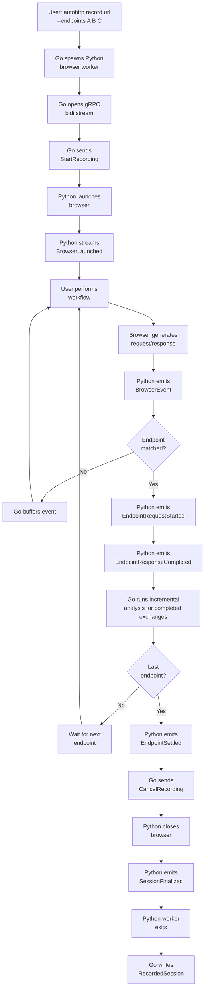

# autohttp End-to-End Data Flow

Date: 2026-06-23

Core goal: use deterministic tree/graph analysis by default and minimize AI calls.

## Recording Flow



## Step-by-Step

### 1. Start Recording

`autohttp record <url> --endpoints ...` starts the Go CLI, which spawns the Python browser worker as a separate subprocess. Go opens a gRPC connection and sends `StartRecording` with the chosen browser, target URL, endpoint definitions, and completion policy.

The Python worker is the only component that talks to a browser. Go never imports a browser SDK.

### 2. Browser Launch

The Python worker loads the adapter for the selected browser:

- Camoufox: `from camoufox.sync_api import Camoufox`
- CloakBrowser: `from cloakbrowser import launch`

After successful launch, the Python worker streams `BrowserLaunched` back to Go.

### 3. User Performs Workflow

The user manually completes the target workflow in the browser. Example: visit login page, enter credentials, solve captcha if needed, reach authenticated dashboard, and perform the target action.

`autohttp` does not try to automate this step initially. It records what the real browser did.

### 4. Stream Browser Events

For every request and response, the browser adapter emits `BrowserEvent` protobuf messages on the gRPC stream:

- `RequestStarted`
- `ResponseHeaders`
- `ResponseBody`
- `RedirectObserved`
- `StorageSnapshot` (cookies, localStorage, sessionStorage)
- `EndpointRequestStarted` / `EndpointResponseCompleted` / `EndpointSettled`

`OPTIONS` and `HEAD` requests are emitted as raw events but ignored for endpoint matching.

### 5. Live Endpoint Matching

The Python worker performs live endpoint matching against the user's defined endpoint sequence:

- Each endpoint has at least a URL path. Optional method, status, and body hints can be added later.
- The endpoint sequence is ordered by default. Only the current expected endpoint advances the flow.
- A match emits `EndpointRequestStarted` on the request phase and `EndpointResponseCompleted` on the response phase.
- The ordered milestone advances on `EndpointResponseCompleted`.
- Earlier or later matches are recorded as observations but do not advance the cursor.

### 6. Incremental Analysis

After each `EndpointResponseCompleted`, Go runs incremental analysis on all captured evidence up to that exchange. This produces:

- A partial `ParsedTree` set
- A partial value index
- A partial set of dependency candidates
- Unresolved candidate regions

Incremental analysis allows Go to start preparing downstream processing while the browser continues. It does not finalize the graph.

### 7. Terminal Settle

The final endpoint is terminal by default. After its response completes, the Python worker waits for bounded browser/network settle. The settle policy is configurable:

- `network-idle` — wait for no in-flight requests for a configurable window.
- `response-only` — finalize immediately on response.
- `url:<path>` — finalize once a navigation to `<path>` is observed.
- `timeout:<duration>` — hard timeout.

Once settled, the Python worker emits `EndpointSettled`.

### 8. Finalize Recording

Go sends `CancelRecording`. The Python worker closes the browser, emits `SessionFinalized`, and exits.

### 9. Normalize Into Canonical Session

Go converts the captured browser event stream into a canonical `RecordedSession` protobuf.

Normalization includes:

- Stable request IDs
- Ordered exchanges
- Canonical header casing
- Parsed cookies
- Decoded request and response bodies
- Parsed storage snapshots
- Redirect relationships (each redirect hop is a separate `HttpExchange` with an explicit `RedirectEdge`)
- Source metadata showing where each field came from

At this stage, `autohttp` preserves raw data and parsed data side by side.

### 10. Offline Analysis

`autohttp analyze` consumes a persisted session artifact and runs:

- Tree parsing on every captured artifact
- Value index construction
- Deterministic dependency discovery
- Dynamic field classification
- Noise filtering
- Logical operation grouping
- Final graph construction

The analyzer emits accepted candidates, rejected candidates, unresolved candidates, confidence scores, evidence paths, and required user decisions.

### 11. Code Generation

`autohttp generate --target go|python` emits a standalone replay script from the final graph.

Generation rules:

- Deterministic templates
- No dependency on `autohttp`, Python, browser engines, or gRPC
- Pure HTTP only
- Each redirect hop is a separate request with `Location` follow disabled
- Unresolved values become explicit user-override stub functions with highly explicit names
- Only the required runtime helpers are included

### 12. Live Verification

`autohttp verify` runs the generated script against the live target and compares the final state to the recorded success condition. The success condition is derived from the terminal endpoint settle behavior.

Failures feed back into the analyzer as evidence, not directly into AI.

## Session Artifact Layout

Each recording produces a project-local artifact directory:

```text
.autohttp/sessions/<session-id>/
  raw/
    browser-events.pb
  normalized/
    session.pb
    session.json
  analysis/
    trees.pb
    value-index.json
    candidates.json
  graph/
    graph.pb
    graph.json
  overrides.yaml
  warnings.json
```

The JSON files are for inspection and debugging. The protobuf files are the source of truth.
