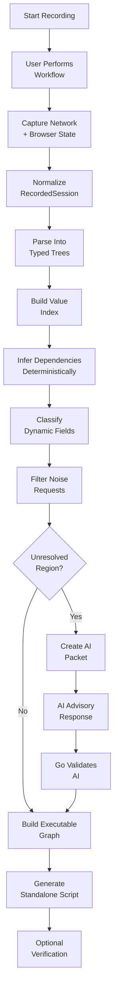

# autohttp — End-to-End Data Flow

Date: 2026-06-21

Core goal: use deterministic tree/graph analysis by default and minimize AI calls.

## Data Flow Diagram

## Step-by-Step

### 1. Start Recording

`autohttp record <url>` starts the Go CLI and launches `camofox-browser` as an external Node process.

Go configures:

- CamoFox port and access key
- Profile/session directory
- Trace directory
- Proxy/GeoIP settings if provided
- VNC or interactive browser mode
- Recording backend selection

Then Go creates the first tab with tracing enabled and assigns a stable `userId` and `sessionKey`.

### 2. User Performs Workflow

The user manually completes the target workflow in CamoFox. Example: visit login page, enter credentials, solve captcha if needed, reach authenticated dashboard, and perform the target action.

`autohttp` does not try to automate this step initially. It records what the real browser did.

### 3. Capture Browser And Network Evidence

The recorder collects all available evidence.

Primary evidence:

- Request method, URL, headers, cookies, and body
- Response status, headers, cookies, and body when available
- Redirect chains
- Request timing and order
- Initiator information if available
- Browser storage state
- JavaScript evaluation results when explicitly requested
- CamoFox trace artifacts

Secondary evidence:

- Accessibility snapshots
- Screenshots
- User action timing
- Page URLs and navigation history
- Challenge/captcha indicators

The output is a raw recording artifact, not yet trusted as a final model.

### 4. Normalize Into Canonical Session

Go converts recorder-specific data into `RecordedSession`.

Normalization includes:

- Stable request IDs
- Ordered exchanges
- Canonical header casing
- Parsed cookies
- Decoded request bodies
- Parsed response bodies
- Storage snapshots
- Redirect relationships
- Source metadata showing where each field came from

At this stage, `autohttp` preserves raw data and parsed data side by side.

### 5. Parse Everything Into Trees

The deterministic parser converts all structured data into typed trees.

Examples:

- `request.url.query.csrf`
- `request.headers.x-csrf-token`
- `request.cookies.session_id`
- `request.body.json.user.email`
- `response.body.json.data.token`
- `response.html.form[0].input[name=_csrf]`
- `storage.local.auth.accessToken`

Every scalar leaf gets a stable path, type, source exchange, and value.

### 6. Build Value Index

Go builds an inverted index across all tree leaves.

For each scalar value, it stores:

- Exact value
- Decoded variants
- Encoded variants
- Tokenized substrings
- JWT components
- Timestamp interpretations
- Hash/UUID/nonce classification
- Entropy score
- First-seen and last-seen locations

This index lets `autohttp` answer where a downstream value came from without asking an LLM.

### 7. Deterministic Dependency Discovery

The analyzer walks the sequence and creates candidate dependency edges.

Examples:

- `response[3].body.json.csrf` → `request[4].headers.x-csrf-token`
- `set-cookie session_id` → later `Cookie: session_id=...`
- `response[1].html hidden input` → later form body field
- `redirect Location?code=...` → later token exchange body
- `localStorage.authToken` → later `Authorization` header
- Previous response nonce → later request query param

Each edge gets a reason and confidence score.

### 8. Dynamic Field Classification

The analyzer marks fields as static, dynamic, or unknown.

Signals:

- Value came from an upstream response, cookie, storage, redirect, or JavaScript evaluation
- Value has high entropy
- Field name matches token/session/nonce/CSRF/fingerprint patterns
- Value changes across repeated recordings
- Value is timestamp-like or expiry-like
- Value appears once and is consumed downstream
- Value is stable across runs and not security-sensitive

Repeated recordings are preferred over AI. If the user records the same workflow twice, `autohttp` can identify dynamic fields more cheaply and reliably.

### 9. Noise Filtering

The analyzer removes or deprioritizes non-functional requests.

Likely noise:

- Static assets
- Fonts, images, and stylesheets
- Analytics
- Ad tech
- Telemetry
- Prefetch and preload
- Error reporting
- Duplicate polling
- CDN cache probes

Noise decisions are confidence-scored. Low-confidence removals remain visible in `autohttp inspect`.

### 10. Logical Operation Grouping

Go groups request sequences into functional units.

Examples:

- `LoadLoginPage`
- `SubmitCredentials`
- `SolveChallenge`
- `ExchangeAuthCode`
- `FetchAccountState`
- `SubmitTargetAction`

This is mostly rule-based using URL paths, method types, timing, dependency edges, and response effects. AI may optionally suggest better names, but grouping should work without it.

### 11. AI Escalation Only For Ambiguity

AI is skipped unless deterministic confidence falls below a configured threshold.

Escalation packet includes only the ambiguous slice:

- Relevant request/response tree paths
- Candidate values
- Candidate edges
- Confidence scores
- Small page/context excerpt if needed
- The exact question to answer

The AI worker does not receive the full recording by default and does not generate final code. Go validates AI output against observed evidence before accepting it.

### 12. Build Executable Graph

The graph engine converts validated analysis into the final intermediate representation.

Graph contains:

- HTTP request nodes
- Extraction nodes
- Cookie/storage update nodes
- JavaScript/browser-required nodes
- Captcha solver nodes
- Conditional/fallback nodes
- Logical operation nodes

The graph is the source of truth for generation.

### 13. Generate Standalone Script

The generator emits Go or Python code from the graph.

Generation rules:

- Deterministic templates
- No dependency on `autohttp` services
- No dependency on `g4f`
- No generated LLM code path
- Include only required runtime helpers
- Prefer pure HTTP execution
- Include browser-assisted fallback only when graph requires it

### 14. Optional Verification

`autohttp` can run the generated script once and compare:

- Final status code
- Expected redirect or landing URL
- Required extracted fields
- Auth/session continuity
- User-defined success condition
- Response shape similarity

Failures feed back into the analyzer as evidence, not directly into AI.