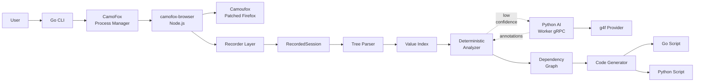

# autohttp Design Spec

Date: 2026-06-21

## Goal

`autohttp` is an open-source, hybrid Go and Python project that records a real browser workflow, reconstructs the functional HTTP request graph, and generates standalone Go or Python scripts that can replay the workflow with fresh dynamic state.

The core design goal is to minimize AI usage. `autohttp` should be a deterministic request graph compiler first. LLMs are optional ambiguity resolvers, not the main engine.

## Core Principles

- Go owns orchestration, parsing, deterministic analysis, graph construction, code generation, and verification.
- CamoFox runs as an external Node.js browser backend through `@askjo/camofox-browser` and the Camoufox patched Firefox engine.
- Python is isolated behind gRPC and used only for optional AI escalation through a provider-neutral interface.
- `g4f` is the default open-source AI provider, not a hard architectural dependency.
- Generated scripts are standalone and do not depend on `autohttp`, gRPC, Python AI services, or `g4f`.
- Deterministic tree parsing, value indexing, and dependency graph analysis should solve the common path without AI.

## Architecture Summary



The correct mental model is:

```text
CamoFox records.
Go parses trees, indexes values, builds the dependency graph, and generates code.
Python/g4f only resolves low-confidence ambiguity.
Generated scripts run standalone.
```

## Related Specs

- [Component architecture & visual diagrams](./architecture.md)
- [End-to-end data flow](./data-flow.md)
- [Deterministic analysis & AI escalation](./analysis.md)
- [Data contracts & protobuf](./contracts.md)
- [Generated script runtime](./runtime.md)
- [CLI & user workflow](./cli.md)
- [Testing & verification](./testing.md)
- [Trust boundaries & error handling](./trust.md)

## Scope & Milestones

### In Scope

- Deterministic-first session analysis.
- CamoFox-backed browser recording.
- Protobuf contracts shared by Go and Python.
- Optional AI escalation with strict budgets and validation.
- Standalone generated Go/Python scripts.
- Inspectable artifacts and confidence scores.

### Out Of Scope For Initial Implementation

- Fully autonomous browser interaction before recording.
- AI-generated final executable code.
- Self-healing generated scripts powered by LLMs.
- Mandatory proxy/MITM capture.
- Commercial hosted analyzer.
- Complete anti-bot bypass coverage for all vendors.

### Initial Milestones

| # | Milestone | Goal |
|---|-----------|------|
| 1 | Deterministic Core Skeleton | CLI, protobuf contracts, fixture importer, tree parser, value index, basic analyzer, Go script generator |
| 2 | CamoFox Recording | Process manager, trace recorder, session artifacts, storage/cookie capture, normalization |
| 3 | Graph & Robust Generation | Executable graph IR, dynamic value extractors, cookie/storage binding, noise filtering, Go API-mode output |
| 4 | Optional AI Escalation | Python gRPC worker, g4f adapter, ambiguity packet protocol, AI cache, budget/threshold flags |
| 5 | Anti-Bot & Captcha Hooks | Challenge model, captcha provider interface, browser-assisted graph nodes, runtime hooks |
| 6 | OSS Release | README, examples, fixture suite, CI, contribution guide, license compatibility |