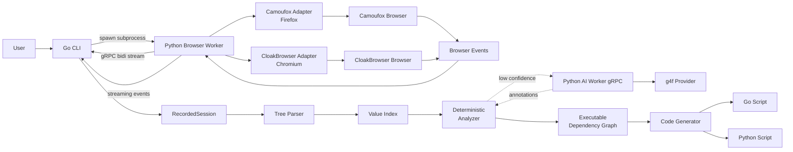

# autohttp Design Spec

Date: 2026-06-23

## Goal

`autohttp` is an open-source, hybrid Go and Python project that records a real browser workflow, reconstructs the functional HTTP request graph, and generates standalone Go or Python scripts that can replay the workflow with fresh dynamic state.

The core design goal is to minimize AI usage. `autohttp` is a deterministic request graph compiler first. LLMs are optional ambiguity resolvers, not the main engine.

## Core Principles

- Go owns orchestration, parsing, deterministic analysis, graph construction, code generation, and verification.
- Python owns browser control. The Python worker is a per-recording subprocess that drives a single browser engine.
- Two supported browser engines: Camoufox (Firefox) and CloakBrowser (Chromium). Each engine runs through its own Python adapter behind a shared browser-event interface.
- Go and the Python worker communicate through one bidirectional gRPC stream for the entire recording session.
- Generated scripts are pure HTTP only. They never drive a browser and never depend on Python AI services, gRPC, or browser engines.
- If a required dynamic value cannot be derived deterministically, it becomes a user-overridable binding in the generated script. The user is responsible for filling it in.
- Deterministic tree parsing, value indexing, and dependency graph analysis solve the common path without AI.
- Python is also used for optional AI escalation through a provider-neutral interface. `g4f` is the default open-source provider, not a hard architectural dependency.

## Architecture Summary



The correct mental model is:

```text
Python browser worker records and observes.
Go parses trees, indexes values, builds the dependency graph, and generates code.
Python/g4f only resolves low-confidence ambiguity.
Generated scripts are pure HTTP and run standalone.
```

## Browser Control

`autohttp` controls two browser engines through Python adapters:

| Browser | Engine | Adapter | Default |
|---------|--------|---------|---------|
| Camoufox | Firefox | `from camoufox.sync_api import Camoufox` | Yes |
| CloakBrowser | Chromium | `from cloakbrowser import launch` | No |

Each adapter translates browser-specific events into the shared `BrowserEvent` protobuf vocabulary. Go consumes these events; it does not know which browser produced them.

The browser choice is explicit in the CLI:

```bash
autohttp record <url> --browser camoufox   # default
autohttp record <url> --browser cloak
```

Each recording session uses exactly one browser engine. Comparing cross-browser traces is out of scope initially.

## Endpoints And Orchestration

The user defines ordered endpoint milestones in the CLI:

```bash
autohttp record <url> --endpoints "/send-vcc" "/checksum" "/redeem"
```

The Python worker performs live endpoint matching on the request/response stream. The Go CLI interprets endpoint semantics and orchestrates the flow:

- `OPTIONS` and `HEAD` requests are ignored for endpoint matching.
- The endpoint sequence is ordered by default. Only the current expected endpoint advances the flow.
- Each matched endpoint emits three phase events: `EndpointRequestStarted`, `EndpointResponseCompleted`, `EndpointSettled`.
- The ordered milestone advances on `EndpointResponseCompleted`.
- Go runs incremental analysis after each matched endpoint response completes.
- The terminal endpoint waits for response completion plus bounded browser/network settle before finalizing.
- The `Location` redirect auto-follow must be disabled by default during replay. Each redirect hop is recorded as a separate `HttpExchange` with explicit redirect edges.

## Generated Replay

Generated scripts are pure HTTP only. They never drive a browser. The runtime lives in `runtime/go/` and `runtime/python/`.

```bash
autohttp generate --session <id> --target go
autohttp generate --session <id> --target python
```

When the analyzer cannot derive a required dynamic value deterministically, the value becomes a user-overridable binding in the generated script:

```go
// Computes request[8].headers.x-signature. Observed value at recording was "d4e5f6".
func computeHeaderXSignature(ctx ReplayContext) (string, error) {
    return "", errors.New("implement computeHeaderXSignature")
}
```

Function names are highly explicit and include the target field name.

## Related Specs

- [Component architecture & visual diagrams](./architecture.md)
- [End-to-end data flow](./data-flow.md)
- [Deterministic analysis & AI escalation](./analysis.md)
- [Data contracts & protobuf](./contracts.md)
- [Generated script runtime](./runtime.md)
- [CLI & user workflow](./cli.md)
- [Testing & verification](./testing.md)
- [Trust boundaries & error handling](./trust.md)

## Scope & Milestones

### In Scope

- Deterministic-first session analysis.
- Python browser worker for Camoufox and CloakBrowser.
- Protobuf contracts shared by Go and Python.
- Live endpoint matching in the Python worker.
- Incremental analysis as endpoints complete.
- Standalone generated Go and Python scripts (pure HTTP).
- Inspectable artifacts and confidence scores.
- User-overridable bindings for unresolved values.
- Optional AI escalation with strict budgets and validation.
- Live verification of generated scripts against the target.

### Out Of Scope For Initial Implementation

- Fully autonomous browser interaction before recording.
- Browser-assisted replay (generated scripts are pure HTTP only).
- AI-generated final executable code.
- Self-healing generated scripts powered by LLMs.
- Mandatory proxy/MITM capture.
- Commercial hosted analyzer.
- Complete anti-bot bypass coverage for all vendors.
- Persistent Python browser worker daemon.
- Cross-browser trace comparison.
- JavaScript evaluation probes.

### Initial Milestones

| # | Milestone | Goal |
|---|-----------|------|
| 1 | Deterministic Core Skeleton | CLI, protobuf contracts, fixture importer, tree parser, value index, basic analyzer, Go script generator |
| 2 | Python Browser Worker | `browser.proto` streaming contract, per-recording subprocess, Camoufox and CloakBrowser adapters, endpoint matching |
| 3 | Live Recording & Endpoint Flow | `autohttp record` with `--endpoints`, ordered milestone advancement, incremental analysis, terminal settle |
| 4 | Pure HTTP Replay | `runtime/go/` and `runtime/python/`, Go and Python code generation, user-override bindings, live verification |
| 5 | Optional AI Escalation | Python AI gRPC worker, g4f adapter, ambiguity packet protocol, AI cache, budget/threshold flags |
| 6 | Anti-Bot & Captcha Hooks | Challenge model, captcha provider interface, graph marking for required browser-assisted regions (out of scope for replay, recorded as notes) |
| 7 | OSS Release | README, examples, fixture suite, CI, contribution guide, license compatibility |
