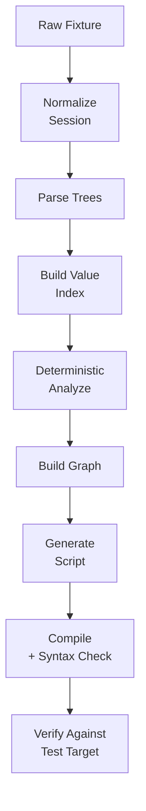

# autohttp — Testing & Verification Strategy

Date: 2026-06-21

## Testing And Verification Strategy

### Core Verification Goals

Testing should prove that `autohttp` works without relying on AI.

Primary guarantees:

- Captured sessions normalize correctly.
- Trees preserve all important request/response fields.
- Value indexing finds encoded and transformed values.
- Deterministic analyzer identifies dependencies.
- Generated scripts bind dynamic state correctly.
- AI-disabled mode remains useful and inspectable.

### Test Flow



### Test Layers

**Unit tests** focus on deterministic core logic:

- URL/header/cookie/body parsing
- JSON/form/HTML tree generation
- Entropy and shape classification
- Value normalization and indexing
- Dependency candidate scoring
- Noise classification
- Graph construction

**Golden fixture tests** use stored recordings as fixtures.

Each fixture includes:

- Raw recording artifact
- Expected parsed tree paths
- Expected dependencies
- Expected dynamic/static classifications
- Expected generated graph

**Generated script tests** should run against stable local test targets:

- Simple CSRF login form
- Hidden input form flow
- JSON API token flow
- Cookie-based session flow
- Redirect OAuth-like flow
- Noise-heavy page with analytics/static assets

**Integration tests** exercise the full pipeline:

```text
record fixture → normalize → parse trees → index → analyze → graph → generate → verify
```

CamoFox live tests should be optional because browser downloads and live websites are slow or flaky.

### AI Tests

AI tests should not call real providers by default.

Use:

- Fake AI worker
- Static ambiguity packet fixtures
- Cached responses
- Schema validation tests
- Rejection tests for hallucinated paths

The project must not require live `g4f` calls in CI.

### Verification Commands

Early project verification should include:

- Go tests
- Go vet/static checks
- Python tests
- Protobuf generation check
- Fixture golden tests
- Generated script compile check